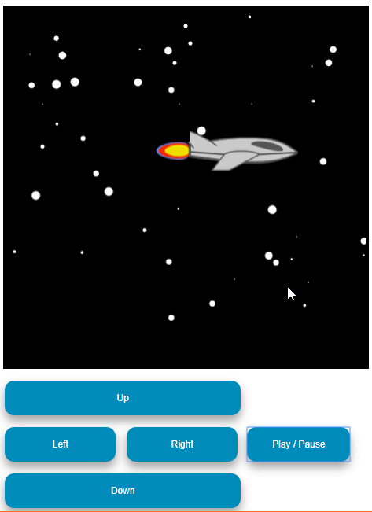
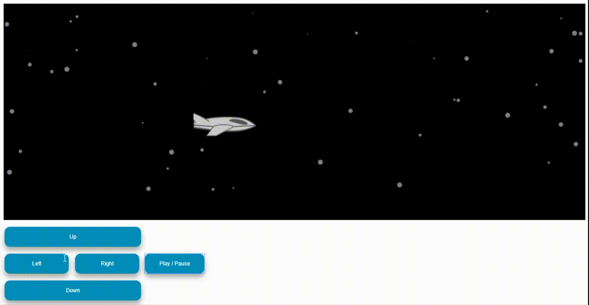

# Not Fancy Canvas Space Scene

A simple, not fancy at all, Space travel scene using HTML5 canvas.
For the [**#notfancyappchallenge**](https://github.com/samanthaming/awesome-notfancyappchallenge) - made, wayyy, under 24 hours.
In this scene, stars glow and move backwards to give a space-travel effect.

### Features include:

- Generates any amount of stars
- Bigger stars move faster than smaller once to give a sense of distance
- Contains a move-able space ship, in any direction
- Play / Pause scene and music

### Built using

- [FabricJS](http://fabricjs.com/)

Play around with it on [CodePen](https://codepen.io/naseeri/pen/RYLJVZ)

Credits:

- [Music](https://opengameart.org/content/determined-to-fly)
- [Jet Image](https://opengameart.org/content/space-jet-side-sprite)

**_Have Fun!_**
